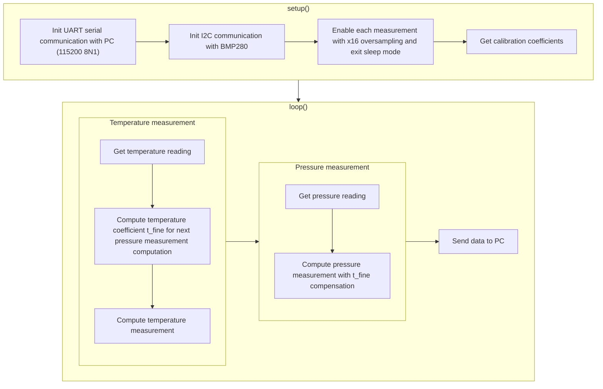

# Serial Communication - Part IV

</br>

[I2C is a serial communication protocol](https://en.wikipedia.org/wiki/I²C) among the many that exist. What makes it interesting to learn about I2C is that it is a widely used protocol. In this practice, we will see how to operate with it. To do this, we will use an atmospheric sensor, the [BMP280 from Bosch](https://www.bosch-sensortec.com/products/environmental-sensors/pressure-sensors/bmp280/), which measures temperature, and atmospheric pressure. To work with it, we will need to know how to perform write and read operations through I2C, while also manipulating the read bytes to combine or shift their bits.

While in MASB we focus on programming, I always like to give a brief overview of the most basic aspects of, in this case, I2C communication at the electronics level. This helps us understand what we are really doing when we program.

I2C communication is a type of communication between a master and one or more slaves. The master manages the communication bus by arbitrating who speaks at any given time. Each device connected to the I2C bus has its own address, which the master uses to indicate who should receive the data being transmitted over the bus. This communication bus is implemented on 2 lines: SDA and SCL. The SCL line carries a clock signal during a write or read operation. This clock signal is generated by the master, and for any communication to exist, there must be a clock. When there is no communication, the master sets the SCL signal to a high level.

The SDA line behaves similarly. If no information is being transmitted, it remains at a high level. This signal carries the actual data. The value of SDA is read at each clock edge.


> From en:user:Cburnett - Own work made with Inkscape, CC BY-SA 3.0, [https://commons.wikimedia.org/w/index.php?curid=1472017](https://commons.wikimedia.org/w/index.php?curid=1472017)

Finally (we don't need to know much more to operate with I2C), the protocol specifies that device addresses must be 7 bits. This address is sent in the first byte of the communication (in I2C, data is sent in byte packets, each containing 8 bits), followed by the rest of the bytes that the slave indicated by the address in the first byte should receive.

"_But hey Albert, if packets are 8 bits, why is the address 7 bits?_" Good question, Alicia. One point for you. **The first byte containing the slave's address uses the 7 most significant bits to indicate the address and the least significant bit to indicate whether a write operation (0) or a read operation (1) is being performed.**

If the operation is a write, after sending the address, the master continues sending bytes. If it is a read operation, the master sends the first byte with the address and the operation to be performed, and does not send anything through SDA while continuing to generate a clock signal on SCL so that the indicated slave responds.

But, hey! I won't bore you anymore. With this, you have more than enough to start programming I2C on Arduino. Let's get to it! 💪

## Objectives

- Introduction to synchronous serial communication I2C on Arduino.
- Use of the Arduino Wire library for I2C communication.
- Byte combination.
- Bit shifting.
- Refactoring and modularization.

## Procedure

In this practice, we will read the temperature, and atmospheric pressure using a Bosch BMP280. In this [link](https://www.bosch-sensortec.com/media/boschsensortec/downloads/datasheets/bst-bmp280-ds001.pdf), you can find the component's datasheet. Keep it handy! The application we will implement follows this execution flow:



### Module Connection and Communication Setup

Let's start at the beginning and connect the BMP280 module to our evaluation board (EVB). From the module, we will use 4 of its pins: VIN, GND, SCL, and SDA. We will connect them to our evaluation board following the table below.

> [!IMPORTANT]
> Remember to make the connections with the power disconnected! That is, **disconnect the USB from the computer**.

| NUCLEO-F401RE | BMP280 | Description                                                                                                                                                                                                                    |
| ------------- | ------ | ------------------------------------------------------------------------------------------------------------------------------------------------------------------------------------------------------------------------------ |
| 3V3           | VIN    | Power pin. A voltage of 3.0 to 5.0 V must be connected, which will generate a 3.0 V voltage to power the module's electronics.                                                                                                 |
| GND           | GND    | Reference voltage for both power and digital signals.                                                                                                                                                                          |
| SCL/D15       | SCL    | The module operates with both SPI (another type of synchronous communication) and I2C. This pin is shared between both types of communication and corresponds to the clock signal, which in I2C corresponds to the SCL signal. |
| SDA/D14       | SDA    | Same as the SCL pin. It is shared between the two available communication types: SPI and I2C.                                                                                                                                  |

Once connected, plug the EVB into the computer and perform a minimal communication with the module to simply check that we have connected it correctly and that the module is working. To do this, we will try to read a register from the BMP280 that contains the sensor ID. If we can read it and its value is correct, we can ensure that the sensor is properly connected and operating correctly.

> [!NOTE]
>
> **Registers**
>
> Think of registers as a table where each cell has an associated address that identifies it within the table. Each cell contains information we want to read (e.g., measurement results or the sensor ID) or write (e.g., to configure the sensor). When we want to read/write to one of these cells or registers, we must first provide the address of that cell/register and then provide the value to write to it in the case of a write operation, or read the value returned by the sensor in the case of a read operation. Remember that the type of operation (read/write) is indicated by the last bit of the first byte (which also sends the slave's address).

First of all, start from the `main` branch, create a branch named `arduino/<username>/bmp280`, and create a project named `bmp280` (create it inside the folder named after your username within the workspace). Let's go.

The register with the sensor ID has the address `0xD0`, and its value is `0x58`. Therefore, if we try to read this register and get the expected value, we can deduce that everything is connected correctly. Let's do it. The code we will use is as follows:

```cpp
#include <Arduino.h>
// Include the Wire library, which manages I2C communication
#include <Wire.h>

// Instead of writing the register addresses manually,
// we use macros to improve code readability and maintainability
#define BMP280_ADDRESS 0x76 // Sensor address
#define BMP280_REG_ID 0xD0  // Address of the register containing the sensor ID

void setup()
{

  // Initialize UART communication with the computer
  Serial.begin(115200);

  // Initialize the I2C communication library
  Wire.begin();

  // Start communication with the sensor
  // It is necessary to indicate the sensor's address (not to be confused with the
  // address of each of the sensor's registers)
  Wire.beginTransmission(BMP280_ADDRESS);

  // Write/indicate the address of the register we want to read
  Wire.write(BMP280_REG_ID);

  // End the communication
  Wire.endTransmission();

  // Request the value of the register we previously indicated
  // To do this, we also indicate the number of bytes we expect (in this
  // case, only 1)
  Wire.requestFrom(BMP280_ADDRESS, 1);

  // Wait until the expected byte is available
  while (Wire.available() < 1)
  {
  };

  // Read the received value
  uint8_t id = Wire.read();

  // Check if the received value is as expected and indicate
  // the result via the serial terminal
  if (id == 0x58)
  {
    Serial.println("BMP280 connected!");
  }
  else
  {
    Serial.println("No BMP280 found...");
  }
}

// Here we do nothing for now...
void loop()
{
}
```

The reading process is simple. First, we send the address of the register we want to read. This is done with the `Wire.beginTransmission` instruction, which automatically sends the slave's address and the operation bit set to 0 (write). Then, with the `Wire.write` instruction, we send the address of the register we want to be returned later. We end the communication with, oh surprise, `Wire.endTransmission`.

```cpp
...
Wire.beginTransmission(BMP280_ADDRESS);
Wire.write(BMP280_REG_ID);
Wire.endTransmission();
...
```

Then, once we have "written" the address of the register we want to read, we "read" its content. This is done with the `Wire.requestFrom` instruction. This function automatically sends the slave's address and the operation bit set to 1 (read).

```cpp
...
Wire.requestFrom(BMP280_ADDRESS, 1);
while(Wire.available() < 1) {};
uint8_t id = Wire.read();
...
```

In `Wire.requestFrom`, we indicate the device's address and then the number of bytes we want to receive. In this case, only 1, but we could request more than one. If this were the case, the first byte would be the value at the indicated address, and the following bytes would be the values of the consecutive registers. For example, if we wanted to read registers `0x01`, `0x02`, and `0x03`, we could do:

```cpp
...
// Value of register 0x01
Wire.beginTransmission(BMP280_ADDRESS);
Wire.write(0x01);
Wire.endTransmission();

Wire.requestFrom(BMP280_ADDRESS, 1); // Expecting 1 byte
while(Wire.available() < 1) {};

uint8_t value1 = Wire.read();

// Value of register 0x02
Wire.beginTransmission(BMP280_ADDRESS);
Wire.write(0x02);
Wire.endTransmission();

Wire.requestFrom(BMP280_ADDRESS, 1); // Expecting 1 byte
while(Wire.available() < 1) {};

uint8_t value2 = Wire.read();

// Value of register 0x03
Wire.beginTransmission(BMP280_ADDRESS);
Wire.write(0x03);
Wire.endTransmission();

Wire.requestFrom(BMP280_ADDRESS, 1); // Expecting 1 byte
while(Wire.available() < 1) {};

uint8_t value3 = Wire.read();
...
```

or we can do it more compactly:

```cpp
...
// Value of registers 0x01, 0x02, and 0x03
Wire.beginTransmission(BMP280_ADDRESS);
Wire.write(0x01);
Wire.endTransmission();

Wire.requestFrom(BMP280_ADDRESS, 3); // Expecting 3 bytes
while(Wire.available() < 3) {};

uint8_t value1 = Wire.read();
uint8_t value2 = Wire.read();
uint8_t value3 = Wire.read();
...
```

Easy, right? Especially, keep in mind that this only works for **consecutive registers**!

Well, if the code works and we see "BMP280 connected!", we move forward. If not, check the connections.

### Reading the Temperature

Let's proceed with the first measurement. In this case, the temperature. To do this, the first thing we need to do is enable that measurement and put the sensor in "Normal" mode. By default, the [measurements are disabled](https://www.bosch-sensortec.com/media/boschsensortec/downloads/datasheets/bst-bmp280-ds001.pdf#page=17) and in [sleep mode](https://www.bosch-sensortec.com/media/boschsensortec/downloads/datasheets/bst-bmp280-ds001.pdf#page=15) (low power) when the sensor is powered on.

#### Temperature Configuration

The register where we indicate the configuration to enable temperature measurement and put the sensor in "Normal" mode is `ctrl_meas`, with address `0xF4`. This register contains the configuration for different aspects of the sensor (it is very common for different configurations to share the same register to avoid oversizing the memory needed to store these registers). Each bit or group of bits in the register configures different aspects of the sensor. In the case of the `ctrl_meas` register, the different configurations are:

| Bits    | Name        | Description                                  |
| ------- | ----------- | -------------------------------------------- |
| 7, 6, 5 | osrs_t[2:0] | Configures the temperature measurement mode. |
| 4, 3, 2 | osrs_p[2:0] | Configures the pressure measurement mode.    |
| 1, 0    | mode[1:0]   | Configures the sensor's operating mode.      |

In this case, we are only concerned with the osrs_t[2:0] and mode[1:0] bits. As we can see in the sensor's [datasheet](https://www.bosch-sensortec.com/media/boschsensortec/downloads/datasheets/bst-bmp280-ds001.pdf#page=13), to enable temperature measurement, we need to indicate one of these values:

| osrs_t[2:0] | Temperature Measurement Mode |
| ----------- | ---------------------------- |
| 000         | Disabled (default)           |
| 001         | Oversampling x1              |
| 010         | Oversampling x2              |
| 011         | Oversampling x4              |
| 100         | Oversampling x8              |
| ≥101        | Oversampling x16             |

As long as it is not in mode 000, it will be sufficient to enable temperature measurement. Oversampling means taking a series of points and averaging them to reduce noise in the measurement. We will choose the maximum oversampling of x16 (i.e., it will take 16 temperature measurements and return their average). To do this, we will choose `osrs_t[2:0] = 101`.

To configure the "Normal" mode, following the datasheet's instructions, we will set `mode[1:0] = 11`.

Let's do it in the code:

```cpp
#include <Arduino.h>
#include <Wire.h>

#define BMP280_ADDRESS 0x76
#define BMP280_REG_ID 0xD0
#define BMP280_REG_CTRL_MEAS 0xF4 // Configuration register address

void setup()
{
  Serial.begin(115200);

  Wire.begin();
  Wire.beginTransmission(BMP280_ADDRESS);
  Wire.write(BMP280_REG_ID);
  Wire.endTransmission();
  Wire.requestFrom(BMP280_ADDRESS, 1);
  while (Wire.available() < 1)
  {
  };

  uint8_t id = Wire.read();
  if (id == 0x58)
  {
    Serial.println("BMP280 connected!");
  }
  else
  {
    Serial.println("No BMP280 found...");
  }

  // Write the configuration to the register
  Wire.beginTransmission(BMP280_ADDRESS);

  Wire.write(BMP280_REG_CTRL_MEAS); // Indicate the register address
  Wire.write(0b10100011);           // Value to be stored
                                    // in the register

  Wire.endTransmission();
}

// Here we do nothing for now...
void loop()
{
}
```

As we can see, we can indicate a value in binary. This is done by indicating `0b` followed by the binary number we want to specify. We can see that we have indicated `0b10100011`, which is `101` `000` `11`, corresponding to `osrs_t[2:0]`, `osrs_p[2:0]`, and `mode[1:0]`, respectively. With this, we have the sensor awake and the temperature measurement enabled. Let's read the measurements the sensor is taking.

#### Temperature Measurement

Before diving into the code, let's see what needs to be done to obtain the measurement. The sensor captures a measurement from its temperature sensor, but this cannot be used directly to indicate the temperature. It is necessary to apply a transformation to obtain the actual temperature. This transformation uses a series of coefficients stored in the device's memory/registers. These values are measured/calculated during the manufacturing of each device and are recorded in its memory. Therefore, each device has unique calibration values. Once we read these calibration values, we apply them to the temperature sensor reading to obtain the actual temperature. What formula/expression/transformation should we apply? The datasheet tells us. We have different compensation formulas (as the datasheet calls them) depending on the desired resolution/precision. We will use the highest precision compensation available [here](https://www.bosch-sensortec.com/media/boschsensortec/downloads/datasheets/bst-bmp280-ds001.pdf#page=44).

It is a lengthy expression that **we should not try to "understand"**. It is an expression provided by the manufacturer, and only they know its origin. We apply it and that's it. Let's do it. First, let's see the complete code, and then we will go through each section to understand what we are doing:

```cpp
#include <Arduino.h>
#include <Wire.h>

#define BMP280_ADDRESS 0x76
#define BMP280_REG_ID 0xD0
#define BMP280_REG_CTRL_MEAS 0xF4
#define BMP280_REG_TEMP 0xFA  // Address of the register with the measurement
#define BMP280_REG_DIG_T 0x88 // Address of the compensation register

void setup()
{
  Serial.begin(115200);

  Wire.begin();
  Wire.beginTransmission(BMP280_ADDRESS);
  Wire.write(BMP280_REG_ID);
  Wire.endTransmission();
  Wire.requestFrom(BMP280_ADDRESS, 1);
  while (Wire.available() < 1)
  {
  };

  uint8_t id = Wire.read();
  if (id == 0x58)
  {
    Serial.println("BMP280 connected!");
  }
  else
  {
    Serial.println("No BMP280 found...");
  }

  // Write the configuration to the register
  Wire.beginTransmission(BMP280_ADDRESS);

  Wire.write(BMP280_REG_CTRL_MEAS); // Indicate the register address
  Wire.write(0b10100011);           // Value to be stored
                                    // in the register

  Wire.endTransmission();
}

void loop()
{

  // Read the temperature measurement value
  Wire.beginTransmission(BMP280_ADDRESS);

  Wire.write(BMP280_REG_TEMP);

  Wire.endTransmission();

  Wire.requestFrom(BMP280_ADDRESS, 3);

  while (Wire.available() < 3)
  {
  };

  int32_t adc_T = ((int32_t)Wire.read()) << 12;
  adc_T = adc_T | (((int32_t)Wire.read()) << 4);
  adc_T = adc_T | (((int32_t)Wire.read()) >> 4);

  // Read the calibration register values for temperature
  Wire.beginTransmission(BMP280_ADDRESS);

  Wire.write(BMP280_REG_DIG_T);

  Wire.endTransmission();

  Wire.requestFrom(BMP280_ADDRESS, 6);

  while (Wire.available() < 6)
  {
  };

  uint16_t dig_T1 = ((uint16_t)Wire.read());
  dig_T1 = dig_T1 | (((uint16_t)Wire.read()) << 8);

  int16_t dig_T2 = ((int16_t)Wire.read());
  dig_T2 = dig_T2 | (((int16_t)Wire.read()) << 8);

  int16_t dig_T3 = ((int16_t)Wire.read());
  dig_T3 = dig_T3 | (((int16_t)Wire.read()) << 8);

  // Calculate the calibration coefficient `t_fine`
  double var1 = (((double)adc_T) / 16384.0 - ((double)dig_T1) / 1024.0) * ((double)dig_T2);
  double var2 = ((((double)adc_T) / 131072.0 - ((double)dig_T1) / 8192.0) *
                 (((double)adc_T) / 131072.0 - ((double)dig_T1) / 8192.0)) *
                ((double)dig_T3);

  int32_t t_fine = (int32_t)(var1 + var2);

  // Calculate the temperature
  double temperature = t_fine / 5120.0;

  // Send it to the computer
  Serial.print("T: ");
  Serial.println(temperature);

  delay(500);
}
```

##### Obtaining the Temperature

Now let's see the details. Focusing on the `loop()` function (since the `setup()` function is the same), we start by requesting the temperature measurement, which is found in registers `0xFA`, `0xFB`, and `0xFC`. The sensor takes a 20-bit unsigned measurement (only positive integers). These 20 bits need at least 3 registers since each register only has 8 bits. That's why more than one register is needed to store the measurement. The temperature measurement is recorded in the datasheet as `ut[19:0]`, where `ut[19:12]` corresponds to the bits of register `0xFA`, `ut[11:4]` to the bits of register `0xFB`, and `ut[3:0]` to bits 7, 6, 5, and 4 of register `0xFC`. Since the temperature registers are consecutive, we can read the first register `0xFA` and expect to receive 3 bytes.

```cpp
...
		Wire.beginTransmission(BMP280_ADDRESS);

		Wire.write(BMP280_REG_TEMP);

		Wire.endTransmission();

		Wire.requestFrom(BMP280_ADDRESS, 3);

		while (Wire.available() < 3) {};
...
```

##### Bit Shifting and Combining

Don't be confused by the operation of combining the bits of the different registers to obtain the temperature measurement. Once the 3 bytes are received, we proceed to read the first one and store it in a 32-bit variable called `adc_T`. This variable will contain the temperature measurement resulting from combining the bits of the 3 registers.

What does `(int32_t)` and `<< 12` mean? As we know, the first register `0xFA` corresponds to bits `ut[19:12]` of the temperature measurement. Therefore, we first convert the received byte to a 32-bit value with `(int32_t)` and then shift the bits to the left by 12 positions with `<< 12`. For example, if the value read in `0xFA` were `0b11111111`, we would first convert that value to a 32-bit value and then shift it to the left by 12 positions:

```cpp
...
	// 0b11111111
	uint8_t value0xFA = Wire.read();

	// 0b00000000000000000000000011111111
	int32_t value0xFA_32b = (int32_t) value0xFA;

	// 0b00000000000011111111000000000000
	int32_t value0xFA_32b_shifted = value0xFA_32b << 12;
...
```

All of that is done in a single line with:

```cpp
...
	int32_t adc_T = ((int32_t) Wire.read()) << 12;
...
```

In the following instructions, we incorporate the other 2 bytes into the measurement:

```cpp
...
	adc_T = adc_T | (((int32_t) Wire.read()) << 4);
	adc_T = adc_T | (((int32_t) Wire.read()) >> 4);
...
```

In each instruction, we do what was mentioned earlier: convert the received value to a 32-bit value, shift it the appropriate number of positions for each register, and incorporate it into the temperature value by adding it (the `|` operation is the [bitwise OR](https://en.wikipedia.org/wiki/Bitwise_operations_in_C#Bitwise_OR_|)).

##### Obtaining the Compensation Coefficients

Now it's time to do the same, but with the coefficients recorded in the device's memory to apply the compensation formula. First, we request the coefficients. Since they are consecutive, we can request them all at once, expecting 6 bytes.

```cpp
...
	Wire.beginTransmission(BMP280_ADDRESS);

	Wire.write(BMP280_REG_DIG_T);

	Wire.endTransmission();

	Wire.requestFrom(BMP280_ADDRESS, 6);

	while (Wire.available() < 6) {};
...
```

Then, we do the same as with the temperature and combine the bits to obtain the coefficients:

```cpp
...
	uint16_t dig_T1 = ((uint16_t) Wire.read());
	dig_T1 = dig_T1 | (((uint16_t) Wire.read()) << 8);

	int16_t dig_T2 = ((int16_t) Wire.read());
	dig_T2 = dig_T2 | (((int16_t) Wire.read()) << 8);

	int16_t dig_T3 = ((int16_t) Wire.read());
	dig_T3 = dig_T3 | (((int16_t) Wire.read()) << 8);
...
```

##### Calculating the Compensation Coefficient `t_fine`

From the temperature measurement and the compensation coefficients, the datasheet proposes calculating an intermediate variable called `t_fine`. This new coefficient is also used to calculate pressure since it depends on temperature.

```cpp
...
	double var1 = (((double) adc_T) / 16384.0 - ((double) dig_T1) / 1024.0) * ((double) dig_T2);
	double var2 = ((((double) adc_T) / 131072.0 - ((double) dig_T1) / 8192.0) *
	  (((double) adc_T) / 131072.0 - ((double) dig_T1) / 8192.0)) * ((double) dig_T3);

	int32_t t_fine = (int32_t)(var1 + var2);
...
```

##### Calculating the Compensated Temperature

Now, we apply the compensation formula provided by the datasheet, which, again, we don't need to understand/comprehend its origin; it is given directly by the manufacturer.

```cpp
...
	double temperature = t_fine / 5120.0;
...
```

Once calculated, we send it to the computer. We also add a 500 ms delay to reduce the speed at which new measurements are displayed on the terminal, making them easier to read.

```cpp
...
	Serial.print("T: ");
	Serial.println(temperature);

	delay(500);
}
```

At this point, you should have the ambient temperature displayed on the serial terminal, but make sure you understand what we have been doing in the code, as these are basic byte/bit manipulation operations very common in microcontroller programming and will be needed throughout the rest of the practice and the final project.

### Code Refactoring

I imagine that by now, you must be feeling a bit overwhelmed by so many lines of code... Let's do some refactoring and create functions for each functionality in the code to improve its readability.

Let's start with something simple: two functions, one for writing to the BMP280 registers and another for reading. We will call them: `BMP280_Write()` and `BMP280_Read()`. We are going to do it properly, so we will place it in a separate file called `bmp280.cpp`.

```cpp
#include "bmp280.h"
#include <Wire.h>

void BMP280_Write(uint8_t address, uint8_t regAddress, uint8_t *buffer,
                  uint8_t bytesToWrite)
{

    Wire.beginTransmission(address);
    Wire.write(regAddress);

    for (uint8_t i = 0; i < bytesToWrite; i++)
    {
        Wire.write(buffer[i]);
    }

    Wire.endTransmission();
}
```

And in the corresponding `bmp280.h` we have:

```cpp
#ifndef BMP280_H__
#define BMP280_H__

#include <cstdint>

void BMP280_Write(uint8_t address, uint8_t regAddress, uint8_t *buffer,
                  uint8_t bytesToWrite);

#endif // BMP280_H__
```

Nothing unusual. A function to which we pass the device's address, the register address we want to write to, a buffer or array with the bytes to write, and a number indicating how many bytes will be sent. The code is straightforward. Does it need commenting?

```cpp
void BMP280_Read(uint8_t address, uint8_t regAddress, uint8_t *buffer,
                 uint8_t bytesToRead)
{
    Wire.beginTransmission(address);
    Wire.write(regAddress);
    Wire.endTransmission();

    Wire.requestFrom(address, bytesToRead);

    while (Wire.available() < bytesToRead)
    {
    };

    for (uint8_t i = 0; i < bytesToRead; i++)
    {
        buffer[i] = Wire.read();
    }
}
```

More of the same. A function to which we pass the device's address, the register we want to read, a buffer or array to store the bytes read, and a number indicating how many bytes will be read. Add its declaration to `bmp280.h` too. With just these two functions, let's see how the code looks:

```cpp
#include <Arduino.h>
#include <Wire.h>
#include "bmp280.h"

#define BMP280_ADDRESS 0x76
#define BMP280_REG_ID 0xD0
#define BMP280_REG_CTRL_MEAS 0xF4
#define BMP280_REG_TEMP 0xFA
#define BMP280_REG_DIG_T 0x88

uint8_t tx_buffer[32] = {0}, rx_buffer[32] = {0};

void setup()
{
  Serial.begin(115200);

  Wire.begin();

  BMP280_Read(BMP280_ADDRESS, BMP280_REG_ID, rx_buffer, 1);

  uint8_t id = rx_buffer[0];
  if (id == 0x58)
  {
    Serial.println("BMP280 connected!");
  }
  else
  {
    Serial.println("No BMP280 found...");
  }

  tx_buffer[0] = 0b10100011;
  BMP280_Write(BMP280_ADDRESS, BMP280_REG_CTRL_MEAS, tx_buffer, 1);
}

void loop()
{

  BMP280_Read(BMP280_ADDRESS, BMP280_REG_TEMP, rx_buffer, 3);

  int32_t adc_T = ((int32_t)rx_buffer[0]) << 12;
  adc_T = adc_T | (((int32_t)rx_buffer[1]) << 4);
  adc_T = adc_T | (((int32_t)rx_buffer[2]) >> 4);

  BMP280_Read(BMP280_ADDRESS, BMP280_REG_DIG_T, rx_buffer, 6);

  uint16_t dig_T1 = ((uint16_t)rx_buffer[0]);
  dig_T1 = dig_T1 | (((uint16_t)rx_buffer[1]) << 8);

  int16_t dig_T2 = ((int16_t)rx_buffer[2]);
  dig_T2 = dig_T2 | (((int16_t)rx_buffer[3]) << 8);

  int16_t dig_T3 = ((int16_t)rx_buffer[4]);
  dig_T3 = dig_T3 | (((int16_t)rx_buffer[5]) << 8);

  double var1 = (((double)adc_T) / 16384.0 - ((double)dig_T1) / 1024.0) * ((double)dig_T2);
  double var2 = ((((double)adc_T) / 131072.0 - ((double)dig_T1) / 8192.0) *
                 (((double)adc_T) / 131072.0 - ((double)dig_T1) / 8192.0)) *
                ((double)dig_T3);

  int32_t t_fine = (int32_t)(var1 + var2);

  double temperature = t_fine / 5120.0;

  Serial.print("T: ");
  Serial.println(temperature);

  delay(500);
}
```

Better, right?... No!? I hope I'm hearing a resounding "yes"... Now let's go a bit further. The compensation coefficients are always the same. They are constant values. There's no need to read them all the time. Therefore, we will read them only in the `setup()` function at the beginning of the program execution. Part of the code would look like this:

```cpp
#include <Arduino.h>
#include <Wire.h>
#include "bmp280.h"

#define BMP280_ADDRESS 0x76
#define BMP280_REG_ID 0xD0
#define BMP280_REG_CTRL_MEAS 0xF4
#define BMP280_REG_TEMP 0xFA
#define BMP280_REG_DIG_T 0x88

uint16_t dig_T1 = 0;
int16_t dig_T2 = 0, dig_T3 = 0;
uint8_t tx_buffer[32] = {0}, rx_buffer[32] = {0};

void setup()
{
  Serial.begin(115200);

  Wire.begin();

  BMP280_Read(BMP280_ADDRESS, BMP280_REG_ID, rx_buffer, 1);

  uint8_t id = rx_buffer[0];
  if (id == 0x58)
  {
    Serial.println("BMP280 connected!");
  }
  else
  {
    Serial.println("No BMP280 found...");
  }

  tx_buffer[0] = 0b10100011;
  BMP280_Write(BMP280_ADDRESS, BMP280_REG_CTRL_MEAS, tx_buffer, 1);

  BMP280_Read(BMP280_ADDRESS, BMP280_REG_DIG_T, rx_buffer, 6);

  dig_T1 = ((uint16_t)rx_buffer[0]);
  dig_T1 = dig_T1 | (((uint16_t)rx_buffer[1]) << 8);

  dig_T2 = ((int16_t)rx_buffer[2]);
  dig_T2 = dig_T2 | (((int16_t)rx_buffer[3]) << 8);

  dig_T3 = ((int16_t)rx_buffer[4]);
  dig_T3 = dig_T3 | (((int16_t)rx_buffer[5]) << 8);
}
...
```

Don't your eyes still hurt? Let's modularize the code into functions in `bmp280.cpp`.

```cpp
...
#define BMP280_ADDRESS 0x76
#define BMP280_REG_DIG_T 0x88

static uint16_t dig_T1 = 0;
static int16_t dig_T2 = 0, dig_T3 = 0;

...

void BMP280_GetDigT(void)
{
    uint8_t rx_buffer[32] = {0};

    BMP280_Read(BMP280_ADDRESS, BMP280_REG_DIG_T, rx_buffer, 6);

    dig_T1 = ((uint16_t)rx_buffer[0]);
    dig_T1 = dig_T1 | (((uint16_t)rx_buffer[1]) << 8);

    dig_T2 = ((int16_t)rx_buffer[2]);
    dig_T2 = dig_T2 | (((int16_t)rx_buffer[3]) << 8);

    dig_T3 = ((int16_t)rx_buffer[4]);
    dig_T3 = dig_T3 | (((int16_t)rx_buffer[5]) << 8);
}
```

Remember to add the new function to the `bmp280.h` header. And now, `main.cpp` looks like:

```cpp
#include <Arduino.h>
#include <Wire.h>
#include "bmp280.h"

#define BMP280_ADDRESS 0x76
#define BMP280_REG_ID 0xD0
#define BMP280_REG_CTRL_MEAS 0xF4
#define BMP280_REG_TEMP 0xFA

uint8_t tx_buffer[32] = {0}, rx_buffer[32] = {0};

void setup()
{
  Serial.begin(115200);

  Wire.begin();

  BMP280_Read(BMP280_ADDRESS, BMP280_REG_ID, rx_buffer, 1);

  uint8_t id = rx_buffer[0];
  if (id == 0x58)
  {
    Serial.println("BMP280 connected!");
  }
  else
  {
    Serial.println("No BMP280 found...");
  }

  tx_buffer[0] = 0b10100011;
  BMP280_Write(BMP280_ADDRESS, BMP280_REG_CTRL_MEAS, tx_buffer, 1);

  BMP280_GetDigT();
}

void loop()
{

  BMP280_Read(BMP280_ADDRESS, BMP280_REG_TEMP, rx_buffer, 3);

  int32_t adc_T = ((int32_t)rx_buffer[0]) << 12;
  adc_T = adc_T | (((int32_t)rx_buffer[1]) << 4);
  adc_T = adc_T | (((int32_t)rx_buffer[2]) >> 4);

  double var1 = (((double)adc_T) / 16384.0 - ((double)dig_T1) / 1024.0) * ((double)dig_T2);
  double var2 = ((((double)adc_T) / 131072.0 - ((double)dig_T1) / 8192.0) *
                 (((double)adc_T) / 131072.0 - ((double)dig_T1) / 8192.0)) *
                ((double)dig_T3);

  int32_t t_fine = (int32_t)(var1 + var2);

  double temperature = t_fine / 5120.0;

  Serial.print("T: ");
  Serial.println(temperature);

  delay(500);
}
```

In `main.cpp` we now have errors, since we moved the compensation coefficients to `bmp280.cpp`. We will also move those calculations there to encapsulate all BMP280 functionality in one place, and we will move the initial ID read and temperature configuration to that file as well. The `bmp280.cpp` file will look like:

```cpp
#include "bmp280.h"
#include <Wire.h>

#define BMP280_ADDRESS 0x76
#define BMP280_REG_ID 0xD0
#define BMP280_REG_DIG_T 0x88
#define BMP280_REG_TEMP 0xFA
#define BMP280_REG_CTRL_MEAS 0xF4

static uint16_t dig_T1 = 0;
static int16_t dig_T2 = 0, dig_T3 = 0;
static uint8_t tx_buffer[32] = {0}, rx_buffer[32] = {0};

void BMP280_Write(uint8_t address, uint8_t regAddress, uint8_t *buffer,
                  uint8_t bytesToWrite)
{

    Wire.beginTransmission(address);
    Wire.write(regAddress);

    for (uint8_t i = 0; i < bytesToWrite; i++)
    {
        Wire.write(buffer[i]);
    }

    Wire.endTransmission();
}

void BMP280_Read(uint8_t address, uint8_t regAddress, uint8_t *buffer,
                 uint8_t bytesToRead)
{
    Wire.beginTransmission(address);
    Wire.write(regAddress);
    Wire.endTransmission();

    Wire.requestFrom(address, bytesToRead);

    while (Wire.available() < bytesToRead)
    {
    };

    for (uint8_t i = 0; i < bytesToRead; i++)
    {
        buffer[i] = Wire.read();
    }
}

void BMP280_GetDigT(void)
{
    BMP280_Read(BMP280_ADDRESS, BMP280_REG_DIG_T, rx_buffer, 6);

    dig_T1 = ((uint16_t)rx_buffer[0]);
    dig_T1 = dig_T1 | (((uint16_t)rx_buffer[1]) << 8);

    dig_T2 = ((int16_t)rx_buffer[2]);
    dig_T2 = dig_T2 | (((int16_t)rx_buffer[3]) << 8);

    dig_T3 = ((int16_t)rx_buffer[4]);
    dig_T3 = dig_T3 | (((int16_t)rx_buffer[5]) << 8);
}

int32_t BMP280_GetTemperature(void)
{
    BMP280_Read(BMP280_ADDRESS, BMP280_REG_TEMP, rx_buffer, 3);

    int32_t adc_T = ((int32_t)rx_buffer[0]) << 12;
    adc_T = adc_T | (((int32_t)rx_buffer[1]) << 4);
    adc_T = adc_T | (((int32_t)rx_buffer[2]) >> 4);

    return adc_T;
}

int32_t BMP280_CalculateTFine(int32_t adc_T)
{
    double var1 = (((double)adc_T) / 16384.0 - ((double)dig_T1) / 1024.0) * ((double)dig_T2);
    double var2 = ((((double)adc_T) / 131072.0 - ((double)dig_T1) / 8192.0) *
                   (((double)adc_T) / 131072.0 - ((double)dig_T1) / 8192.0)) *
                  ((double)dig_T3);

    return (int32_t)(var1 + var2);
}

double BMP280_CalculateTemperature(int32_t t_fine)
{
    return t_fine / 5120.0;
}

uint8_t BMP280_GetID(void)
{
    BMP280_Read(BMP280_ADDRESS, BMP280_REG_ID, rx_buffer, 1);

    return rx_buffer[0];
}

void BMP280_EnableTemperatureMeasurement(void)
{
    tx_buffer[0] = 0b10100011;
    BMP280_Write(BMP280_ADDRESS, BMP280_REG_CTRL_MEAS, tx_buffer, 1);
}
```

The `bmp280.h` will look like:

```cpp
#ifndef BMP280_H__
#define BMP280_H__

#include <cstdint>

void BMP280_Write(uint8_t address, uint8_t regAddress, uint8_t *buffer,
                  uint8_t bytesToWrite);
void BMP280_Read(uint8_t address, uint8_t regAddress, uint8_t *buffer,
                 uint8_t bytesToRead);
uint8_t BMP280_GetID(void);
void BMP280_GetDigT(void);
int32_t BMP280_GetTemperature(void);
int32_t BMP280_CalculateTFine(int32_t adc_T);
double BMP280_CalculateTemperature(int32_t t_fine);
void BMP280_EnableTemperatureMeasurement(void);

#endif // BMP280_H__
```

And the `main.cpp` will look like:

```cpp
#include <Arduino.h>
#include <Wire.h>
#include "bmp280.h"

void setup()
{
  Serial.begin(115200);

  Wire.begin();

  uint8_t id = BMP280_GetID();
  if (id == 0x58)
  {
    Serial.println("BMP280 connected!");
  }
  else
  {
    Serial.println("No BMP280 found...");
  }

  BMP280_EnableTemperatureMeasurement();
  BMP280_GetDigT();
}

void loop()
{
  int32_t adc_T = BMP280_GetTemperature();
  int32_t t_fine = BMP280_CalculateTFine(adc_T);
  double temperature = BMP280_CalculateTemperature(t_fine);

  Serial.print("T: ");
  Serial.println(temperature);

  delay(500);
}
```

Let's check that everything works. To do this, make sure that these are your expressions:

[wow.webp](/.github/images/wow.webp)

If not, go back to the beginning...

What madness is this!? But have you seen how understandable the `setup()` and `loop()` functions are now!!? This is readable code. Also, I don't know if you've noticed, but what you've done and what you have in front of you is called


Obviously, very rudimentary and untestable, but a library nonetheless. Congratulations!

## Challenge

We have a sensor that measures temperature and pressure, and we have measured temperature... Can you guess what the challenge will be? Yes, little pony, the challenge is to incorporate the atmospheric pressure measurement into the code and offer it via the terminal along with the temperature. Do it following the same modularity philosophy: create functions for each operation as we did in the refactoring section.

You can imagine that it will be very similar code, but using the relevant registers for pressure measurement. Go for it! (But "no pressure", eh).


Do not create any new branch or project. Implement the challenge in the project we already have (`bmp280`).

When printing the temperature and atmospheric pressure to the terminal, use:

```cpp
  Serial.print("T: ");
  Serial.print(temperature);
  Serial.print(", P: ");
  Serial.println(pressure);
```

Create a Pull Request from the `arduino/<username>/bmp280` branch to `main` and wait for the test results. Correct any undesired behavior detected by the tests, and, once all tests have passed, proceed to merge the Pull Request 🚀

## Evaluation

### Deliverables

These are the elements that should be available to the faculty for your evaluation.

- [ ] **Challenge**
      The challenge must be solved and included with its own commit.

- [ ] **Pull Requests**
      The different Pull Requests requested throughout the practice must also be present in your repository.

## Conclusions

Now we know how to use I2C on Arduino. It is a very, **VERY**, widely used protocol, so knowing how it works will be very useful. Additionally, we have seen how to operate to read and write to registers, as this is the most common method in I2C: reading registers, combining bytes, shifting bits, etc. Finally, we have done a good refactoring of the code to improve its readability. If you still don't believe me, show the code of the `setup()` and `loop()` functions to someone who doesn't know what the code is about, and they will likely understand more or less what it does.

Let's move on to the next part of this practice, where we will do the same with STM32CubeIDE! 💪
